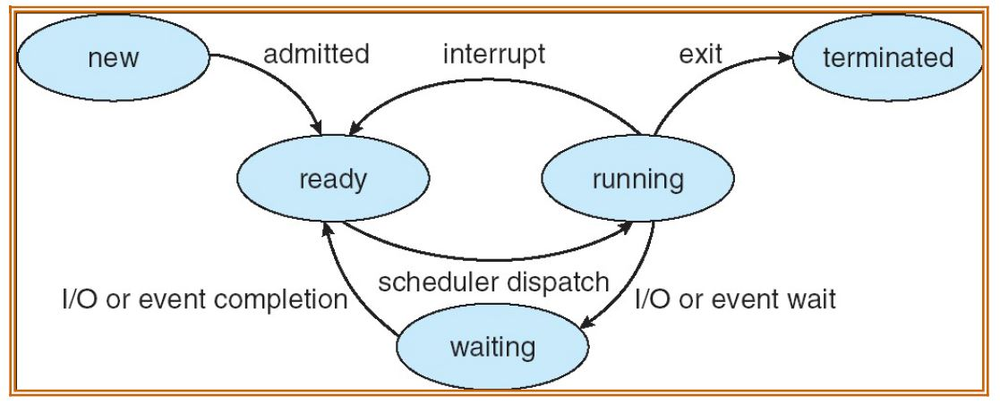

# Scheduler Simulator

by Bardia Parmoun

Released on: 15/05/2021

## DESCRIPTION
- This program is used to simulate the behaviour of a simple scheduler.
- It takes a list of processes and schedulers them based on the given scheduling algorithim and specifications following the behaviour that is specificied in the following state diagram
<p align="center">

</p>
  
- Each process starts from new and is then moved to ready which then moves to running and waits for an I/O which can later move to waiting and get back to the queue. After a process is done executing it goes to terminated.

- The different types of scheduling algorithms that the program considers are first come first serve, priority scheduling and round robin. 
  
## RUNNING THE PROGRAM
1. To run the program first run the makefile to compile the executable file by typing:
```shell
$ gcc scheduler.c -o scheduler
```
2. After that an executable with the name of scheduler has been generated which can then be used with the test cases:
```shell
$ ./kernelsim test1.txt out1.text -flags
```
- Note that the testcases are located in the testcases folder and you need to make sure the file and the test file are located in the same folder. 

- Some examples of the outputs are in the sample outputs folder

- Note that in order to use the program a list of flags need t obe used to specify the behaviour of the program. Here are all the possible flags:

1. -s flag used to specify the type of scheduler. Use 0 for fcfs, 1 for priority, and 2 for round robin. If not specificed the program will use fcfs by default.
2. -t flag used to specify the time slice that the round robin scheduling algorithm will use. If not specificed this 1000ms is used for this value.
3. -m flag used to specify whether memory management should be considered when using these algorithms (1 for using memory management and 0 for noto using it). If not specified this value is 0 by default. 

For example to use the -s flag and the priority scheduler you can use:
```
./scheduler test.txt out.txt -s 1
```
## USING THE PROGRAM
To run the program first a testcase must be provided with a list of processes such as the following example:
```
1 000 020 0000 0000 40 150
2 025 025 0000 0000 30 350
3 030 025 0000 0000 30 150
4 060 015 0000 0000 35 250
5 100 010 0000 0000 05 200
6 105 010 0000 0000 10 300
```
- First column: the process id
- Second column: the arrival time of the process
- Third column: the total time for the process
- Fourth column: the I/O frequency
- Fifth column: the I/O duration
- Sixth column: the priority of the process
- Seventh column: the memory that it requires to run

Here is an example of using that testcase to schedule the processes using priority scheduling and memory management:
```
./scheduler test8.txt out.txt -s 1 -m 1
```
After that the program generates an output file which looks like the following: 
```
 TIME      PID     PREVIOUS    CURRENT


MEMORY HAS BEEN ALLOCATED TO PROCESS 1
Total used memory: 150 Mb
Used memory partitions: 1
Free memory partitions: 3
Total amount of free memory: 850 MB 
Total amount of free usable memory: 500 Mb

    0          1        NEW      READY

    0          1      READY    RUNNING

   20          1    RUNNING TERMINATED


MEMORY HAS BEEN ALLOCATED TO PROCESS 2
Total used memory: 350 Mb
Used memory partitions: 1
Free memory partitions: 3
Total amount of free memory: 650 MB 
Total amount of free usable memory: 500 Mb

   25          2        NEW      READY

   25          2      READY    RUNNING


MEMORY HAS BEEN ALLOCATED TO PROCESS 3
Total used memory: 500 Mb
Used memory partitions: 2
Free memory partitions: 2
Total amount of free memory: 500 MB 
Total amount of free usable memory: 250 Mb

   30          3        NEW      READY

   50          2    RUNNING TERMINATED

   51          3      READY    RUNNING


MEMORY HAS BEEN ALLOCATED TO PROCESS 4
Total used memory: 400 Mb
Used memory partitions: 2
Free memory partitions: 2
Total amount of free memory: 600 MB 
Total amount of free usable memory: 250 Mb

   60          4        NEW      READY

   76          3    RUNNING TERMINATED

   77          4      READY    RUNNING

   92          4    RUNNING TERMINATED


MEMORY HAS BEEN ALLOCATED TO PROCESS 5
Total used memory: 200 Mb
Used memory partitions: 1
Free memory partitions: 3
Total amount of free memory: 800 MB 
Total amount of free usable memory: 500 Mb

  100          5        NEW      READY

  100          5      READY    RUNNING

  110          5    RUNNING TERMINATED


MEMORY HAS BEEN ALLOCATED TO PROCESS 6
Total used memory: 300 Mb
Used memory partitions: 1
Free memory partitions: 3
Total amount of free memory: 700 MB 
Total amount of free usable memory: 500 Mb

  111          6        NEW      READY

  111          6      READY    RUNNING

  121          6    RUNNING TERMINATED


NUMBER OF PROCESSES >>> 6
THROUGHPUT >>> 20.33 ms/process
AVERAGE TURNAROUND TIME >>> 23.83 ms/process
TOTAL WAIT TIME >>> 38 ms
AVERAGE WAIT TIME >>> 6.33 ms/process
AVERAGE CPU BURST TIME >>> 17.50 ms/process
```

- Note that the testfiles should either be in the same directory as the program or the full path needs to be provided.
- Note that the time slice is only used for the round robin scheduler so if the -t flag is specified for the other algorithms it will not affect the behaviour of the program
- Note that the algorithm used for memory management is first fit. It is assumed that the total memory of the system is 1Gb and it has 4 partitions of 500Mb, 250Mb, 150Mb, and 100Mb. 
  
## CREDITS
Author: Bardia Parmoun

Copyright © 2021 Bardia Parmoun. All rights reserved
